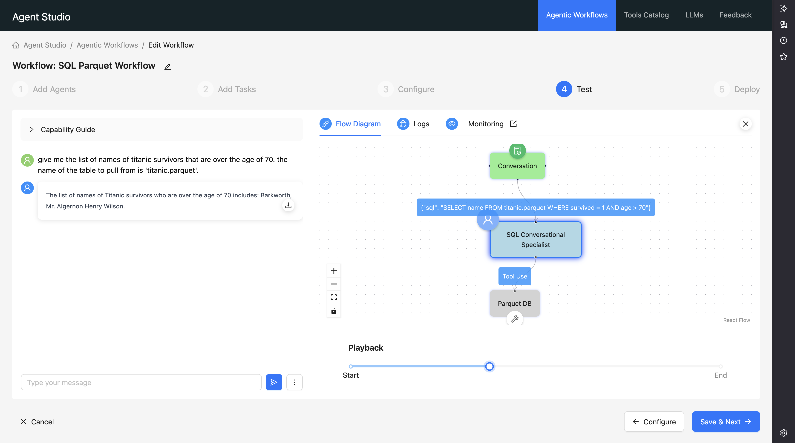

# SQL Queries into Parquet Table Example

This tool shows how to set up an SQL query interface to a parquet file. In this tool, an example parquet file is provided, `titanic.parquet`, that can be used for testing.

## How to Use

* Pull in this entire tool into an Agent Studio tool following [this](../README.md) guide.
* Add any parquet files you want right to the tool directory next to `titanic.parquet`.
* Make sure your agent knows which table to pull out, either in the `Role`/`Goal`/`Backstory` or part of the conversation prompt itself.

In this example, see that `'titanic.parquet'` is explicitly mentioned in the conversation. You can customize this tool to have a specific parquet file to read from for example.
